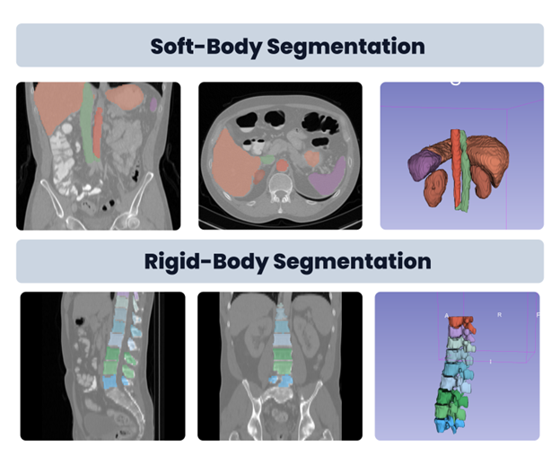
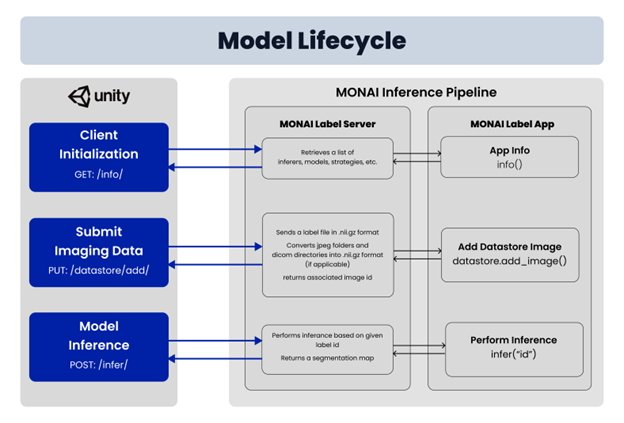
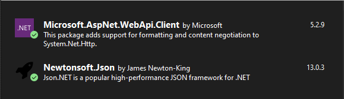

# MonaiLabel for Unity

This project requires an instance of MonaiLabel running that you can access via your network, or run locally [http://localhost:8000](http://localhost:8000). This instance of MonaiLabel will be referred to as `HOST="http://localhost:8000"`.

**Hardware Requirements** - The MonaiLabel Server works stably on a recent version of Ubuntu, with an nvidia GPU.



If you decide to run this server remotely I suggest these 3 security measures be added, since this could potentially handle sensitive data.

1. Secure your instance with HTTPS
   1. [What is an SSL certificate?](https://www.cloudflare.com/learning/ssl/what-is-an-ssl-certificate/)
   2. [Free Universal SSL - Cloudflared](https://developers.cloudflare.com/ssl/edge-certificates/universal-ssl)
2. Only allow one IP address to the server at a time.
   1. This might require your office to pay extra for a Static IP
3. Add authentication to your MonaiLabel server instance

## Install Monai Label (Local)

For more information, visit [Quickstart - Monai Label](https://docs.monai.io/projects/label/en/latest/quickstart.html).
This explains how to install on your machine via the official documentation, however I have made some adjustments/improvements to the instructions.

### Install Anaconda Environment

```bash
python --version # Python 3.9.12
# choose your current python version
conda create -n monai python=3.9
conda activate monai
```

### Install PyTorch (with GPU support)

```bash
nvidia-smi
# look for CUDA Version:
# version <= 11.8, use 'pytorch-cuda=[version]'
# version >  11.8, use 'pytorch-cuda=11.8'
conda install pytorch torchvision torchaudio pytorch-cuda=11.8 -c pytorch -c nvidia
python -c "import torch; print(torch.cuda.is_available())" # Verify installation
# -> True
```

### Install monailabel

```bash
pip install --upgrade pip setuptools wheel
pip install monailabel
monailabel --help # Verify installation
```

### Download Example App into `apps/radiology`

Note - assumes you have installed and verified your monailabel installation

```bash
mkdir apps
monailabel apps --name radiology --download --output apps
```

### Download Example Dataset

Note - assumes you have installed and verified your monailabel installation

```bash
mkdir datasets
monailabel datasets --download --name Task09_Spleen --output datasets
```

### Create your own dataset

You simply have to make a json file in this format and keep note of the directory containing this json file.

#### `dataset.json`

```json
{
    "name": "DatasetName",
    "description": "Dataset Description",
    "reference": "Dataset Reference (Where is data from?)",
    "licence": "IDK CC",
    "release": "1.0 04/26/2023",
    "tensorImageSize": "3D",
    "modality": {
        "0": "CT"
    },
    "labels": {
        "0": "background",
        "1": "class1",
        "2": "class2",
        "3": "class3",
        // ...
    },
    "numTraining": 3,
    "numTest": 2,
    "training": [
        {
            "image": "./relative/path/to/image_1.nii.gz",
            "label": "./relative/path/to/label_1.nii.gz"
        },
        {
            "image": "./relative/path/to/image_2.nii.gz",
            "label": "./relative/path/to/label_2.nii.gz"
        },
        {
            "image": "./relative/path/to/image_3.nii.gz",
            "label": "./relative/path/to/label_3.nii.gz"
        }
        // ...
    ],
    "test": [
        "./relative/path/to/image_4.nii.gz",
        "./relative/path/to/image_5.nii.gz",
        // ...
    ]
}
```

I have constructed one for reference in `/dataset.example.json`

## Start Monai Label

**Note** - you have to install and verify monailabel installation

```bash
monailabel start_server --app apps/radiology --studies [path_to_dataset] --conf models all
```

```bash
# Small Dataset - Testing
monailabel datasets --download --name Task09_Spleen --output datasets
monailabel start_server --app apps/radiology --studies datasets/Task09_Spleen/imagesTr --conf models all
```

## The MonaiLabel Class



### NuGet Dependencies

- [Newtonsoft.Json](https://www.nuget.org/packages/Newtonsoft.Json)
  - More than 3.1 Billion Downloads
- [Microsoft.AspNet.WebApi.Client](https://www.nuget.org/packages/Microsoft.AspNet.WebApi.Client/)
  - More than 397.5 Million Downloads



### Define MonaiLabel Variable

```C#
string URL = "http://localhost:8000";
string TOKEN = "YOUR_ACCESS_TOKEN"; // "" for not auth
string SAVE_DIR = @"C:\Path\To\Directory"; // defaults to OS temporary directory

// Four different initializers
MonaiLabel label = new MonaiLabel();
MonaiLabel labelWithUrl = new MonaiLabel(URL);
MonaiLabel labelWithToken = new MonaiLabel(URL, TOKEN);
MonaiLabel labelWithSaveDir = new MonaiLabel(URL, TOKEN, SAVE_DIR);
```

### `GetInfo` - Get Monai Info

```C#
MonaiInfo info = await label.GetInfo();

// Print Model Info
Console.WriteLine("Saving response outputs to: " + label.SaveDir);  // Print tmp directory location
Console.WriteLine(info.name + "(v" + info.version + ")");
Console.WriteLine(info.description);
Console.WriteLine();

foreach (KeyValuePair<string, MonaiModel> model in info.models)
{
    MonaiModel monaiModel = model.Value;
    Console.WriteLine(model.ToString());
}
```

### `GetDatastore` - Get Datastore Info

```C#
MonaiDatastore datastore = await label.GetDatastore(); // called after every infer task
if (!label.hasDatastore)
{
    Console.Error.WriteLine("Error retrieving datastore.");
    return;
}

// Print Datastore Info
Console.WriteLine(datastore.ToString());
```

### `InferRemote` - Infer from Remote Volume

You can find `imageId` from `GetDatastore`

```C#
// USAGE: label.inferRemote(string model, string imageId, string outputFile) -> Task<MonaiInferResponse>
// Outputs resulting nii.gz file to `[label.SaveDir]/[outputFile]`

MonaiInferResponse response = await label.inferRemote("deepedit", "spleen_3", "spleen_3-label.nii.gz");
Console.WriteLine("Infer Completed");
Console.WriteLine(response.latencies.ToString());
```

### `InferLocal` - Infer from Local Volume

**Note** - Works best when using absolute paths for inputs.

```C#
// USAGE: label.inferRemote(string model, string localInputFile, string localOutputFile) -> Task<MonaiInferResponse>
// Outputs resulting nii.gz file to `[label.SaveDir]/[outputFileName]`
string pathToLocalVolume = @"C:\Path\To\Local\Dir\volume.nii.gz";
string outputFileName = "inference.nii.gz";

MonaiInferResponse response = await label.InferLocal("deepedit", pathToLocalVolume, outputFileName);
Console.WriteLine("Infer Completed");
Console.WriteLine(response.latencies.ToString());
```

### `PutDatastore` - Upload/Add Volume to Datastore

**Note** - Works best when using absolute paths for inputs.

```C#
// USAGE: label.inferRemote(string imageId, string pathToVolumeFile) -> Task<MonaiDatastore>
string pathToVolumeFile = @"C:\Path\To\Local\Dir\volume.nii.gz";

MonaiDatastore datastore = await label.PutDatastore("custom_1", pathToVolumeFile);
Console.WriteLine(datastore.ToString());
```
